# MAVLink-LoRa Bridge For ArduPilot Telemetry

This repository contains two Arduino sketches for an ESP32 + SX1278 half-duplex LoRa bridge between Mission Planner and an ArduPilot flight controller.

- GCS node: receives LoRa packets from the UAV node, reconstructs selected MAVLink messages, and exposes a MAVLink serial stream to Mission Planner.
- UAV node: parses MAVLink from Pixhawk/ArduPilot, compresses selected real-time telemetry into fixed LoRa packets, and forwards selected Mission Planner commands to the flight controller.

The bridge is MAVLink-aware by design. It is not a transparent serial modem. This is required because MAVLink parameter, mission, log, and calibration traffic can exceed the airtime budget of a half-duplex LoRa link, especially at high spreading factors.

No source file uses the old `clean_` prefix.

## Repository Structure

```text
mavlink-lora-bridge/
|-- firmware/
|   |-- GCS_TurboFast/
|   |   |-- GCS_TurboFast.ino
|   |   |-- BeaconDecodeHelpers.h
|   |   |-- GCCalibHelpers.h
|   |   |-- GCSCommandQueue.h
|   |   |-- GCSRadioHelpers.h
|   |   `-- src/common/
|   |       |-- BridgeMavlinkPolicy.h
|   |       |-- LinkProfile.h
|   |       `-- TelemetryProtoFix.h
|   `-- UAV_TurboFast/
|       |-- UAV_TurboFast.ino
|       |-- BeaconFillHelpers.h
|       |-- UAVCalibHelpers.h
|       |-- UAVParamQueue.h
|       |-- UAVRadioHelpers.h
|       `-- src/common/
|           |-- BridgeMavlinkPolicy.h
|           |-- LinkProfile.h
|           `-- TelemetryProtoFix.h
|-- docs/
|   |-- AI_ENGINEERING_NOTES.md
|   |-- AUDIT_REPORT.md
|   |-- CHANGELOG.md
|   |-- CONFIGURATION.md
|   |-- KNOWN_ISSUES.md
|   `-- SF_LINK_POLICY.md
|-- LICENSE
`-- README.md
```

The two `src/common` folders are intentionally duplicated because Arduino IDE builds each sketch from its own sketch directory. Parent-directory includes were already shown to be fragile in this project. The removed `firmware/common` folder was a third copy that was not used by either sketch build path.

The two common header sets must remain byte-identical:

- `TelemetryProtoFix.h`: fixed OTA packet structs, CRC/auth helpers, LoRa airtime helpers, compact command structs, and packet constants.
- `LinkProfile.h`: SF policy, link-mode IDs, and SF-dependent timing helpers, including parameter retry timing and bulk fill-window policy.
- `BridgeMavlinkPolicy.h`: MAVLink compatibility fallbacks, ArduPilot setup command aliases, setup parameter classifier, calibration command classifier, and flight-action command classifier.

## Build Environment

Compile each sketch independently:

1. Open `firmware/GCS_TurboFast/GCS_TurboFast.ino`.
2. Open `firmware/UAV_TurboFast/UAV_TurboFast.ino`.
3. Install the required Arduino dependencies:
   - ESP32 Arduino core.
   - RadioLib with SX1278 support.
   - MAVLink C headers that provide `MAVLink_ardupilotmega.h`.
4. Confirm both nodes use matching RF constants:
   - `FREQ_MHZ`
   - `LORA_BW_KHZ`
   - `LORA_CR_DEN`
   - `LORA_SYNC`
   - `SF_MIN`, `SF_MAX`
   - `TP_MIN`, `TP_MAX`

The current source uses `FREQ_MHZ 420.0`. Verify local spectrum allocation, output power limits, antenna gain, and duty-cycle rules before radiated testing.

Arduino-local includes must remain in this form:

```cpp
#include "src/common/TelemetryProtoFix.h"
#include "src/common/LinkProfile.h"
#include "src/common/BridgeMavlinkPolicy.h"
```

Do not use absolute includes such as `/common/TelemetryProtoFix.h`, and do not rely on parent-directory includes such as `../common/...`.

## System Architecture

The bridge is organized as two independent Arduino sketches joined by a fixed over-the-air protocol. Each sketch owns its local serial interface, radio driver, MAVLink parsing/re-encoding, queueing, and mode state. The common headers define only shared packet layouts, link policy, and MAVLink command classification.

```mermaid
flowchart LR
  MP["Mission Planner"] -->|"MAVLink serial"| GCS_UART["GCS UART"]
  GCS_UART --> GCS_PROTO["GCS MAVLink parser and scheduler"]
  GCS_PROTO --> GCS_RADIO["SX1278 LoRa GCS"]
  GCS_RADIO <-->|"Half-duplex LoRa packets"| UAV_RADIO["SX1278 LoRa UAV"]
  UAV_RADIO --> UAV_PROTO["UAV scheduler and MAVLink proxy"]
  UAV_PROTO --> PIX_UART["Pixhawk UART"]
  PIX_UART <-->|"MAVLink ArduPilotMega"| FC["ArduPilot flight controller"]
```



Traffic classes are intentionally separated:

| Layer | Main files | Responsibility |
| --- | --- | --- |
| RF/PHY | `GCSRadioHelpers.h`, `UAVRadioHelpers.h`, `LinkProfile.h` | SF/TP policy, RX timeout, ACK timing, scanning, and locked-link recovery. |
| OTA protocol | `TelemetryProtoFix.h` | Packed packet structures, CRC/auth tag, compact telemetry, raw MAVLink, parameter bulk, ACK, and config packets. |
| MAVLink policy | `BridgeMavlinkPolicy.h` | Mission Planner setup command classification, calibration command classification, and flight-action prioritization. |
| Telemetry | `BeaconFillHelpers.h`, `BeaconDecodeHelpers.h` | UAV compact beacon generation and GCS reconstruction of selected MAVLink messages. |
| Parameter sync | `UAVParamQueue.h`, GCS/UAV main sketches | Indexed `PARAM_REQUEST_READ` proxy and bounded `PARAM_BULK` transport. |
| Calibration/setup | `GCCalibHelpers.h`, `UAVCalibHelpers.h` | Setup-mode hold, compass progress forwarding, ACK/status prioritization. |

The link is modeled as a half-duplex LoRa channel carrying:

- compact periodic telemetry beacons;
- high-priority raw MAVLink command, ACK, and status packets;
- compact command packets;
- bounded parameter bulk packets;
- RF configuration proposal/acknowledgement packets.

The scheduler exists because LoRa time-on-air grows rapidly with spreading factor. A MAVLink parameter transfer that is acceptable on USB can starve flight command feedback and telemetry freshness on SF10-SF12.

## Mathematical Model

This section defines the measurement model used to reason about throughput, latency, packet loss, and energy. The equations are engineering models for analysis and test planning. They do not replace RF bench measurement because SX1278 module layout, antenna matching, local interference, MCU scheduling, and Mission Planner retry behavior affect the final result.

### LoRa Time-On-Air

Let:

- $$SF \in \{7,8,9,10,11,12\}$$ be the LoRa spreading factor.
- $$BW$$ be RF bandwidth in Hz.
- $$CR_{den} \in \{5,6,7,8\}$$ be the coding-rate denominator for LoRa coding rate $$4/CR_{den}$$.
- $$PL$$ be PHY payload length in bytes.
- $$CRC \in \{0,1\}$$ indicate whether LoRa PHY CRC is enabled.
- $$IH \in \{0,1\}$$ indicate implicit header mode, where $$IH=0$$ is explicit header.
- $$DE \in \{0,1\}$$ indicate low-data-rate optimization.
- $$N_{pre}$$ be configured preamble length in symbols.

The symbol duration is:

$$
T_{sym} = \frac{2^{SF}}{BW}
$$

The preamble duration is:

$$
T_{pre} = \left(N_{pre} + 4.25\right)T_{sym}
$$

The payload symbol count used by the firmware estimator is:

$$
N_{pl} = 8 + \max\left(
\left\lceil
\frac{8PL - 4SF + 28 + 16CRC - 20IH}
{4\left(SF - 2DE\right)}
\right\rceil CR_{den},
0
\right)
$$

The payload duration and packet time-on-air are:

$$
T_{pl} = N_{pl}T_{sym}
$$

$$
T_{pkt} = T_{pre} + T_{pl}
$$

The dominant scaling term is $$2^{SF}$$. For fixed bandwidth, moving from SF7 to SF12 increases symbol duration by:

$$
\frac{T_{sym,SF12}}{T_{sym,SF7}} =
\frac{2^{12}/BW}{2^7/BW} =
2^{5} =
32
$$

Payload symbol count also changes with $$SF$$, so packet airtime is not exactly multiplied by 32 for every packet size. The equation is still the correct first-order explanation for why SF10-SF12 are treated as monitoring modes rather than setup/parameter-transfer modes.

The nominal uncoded PHY bit-rate approximation is:

$$
R_b =
\frac{SF \cdot BW \cdot \left(4/CR_{den}\right)}
{2^{SF}}
$$

The firmware reports this in kbit/s as:

$$
R_{b,kbps} =
\frac{SF \cdot BW \cdot \left(4/CR_{den}\right)}
{2^{SF}\cdot 1000}
$$

This excludes preamble, header, CRC, guard time, RX windows, retransmission, queueing, and serial-port delay.

### Channel Utilization

For each traffic class $$i$$:

- $$T_i$$ is LoRa time-on-air.
- $$G_i$$ is turnaround, guard, and listen overhead.
- $$P_i$$ is the intended emission period.
- $$A_i$$ is the expected retransmission multiplier, where $$A_i \ge 1$$.

Approximate half-duplex channel utilization is:

$$
U =
\sum_{i=1}^{n}
\frac{A_i\left(T_i + G_i\right)}
{P_i}
$$

The operating condition is:

$$
U < U_{max}
$$

In a robust field system, $$U_{max}$$ must be lower than 1.0 because Mission Planner retries, ArduPilot stream bursts, radio turnaround, and MCU jitter consume the residual budget. A practical test campaign should estimate margin as:

$$
M_U = 1 - U
$$

and reject configurations where $$M_U$$ is small during parameter sync or calibration.

### Packet Delivery And Loss

Let $$N_{tx}$$ be transmitted packets and $$N_{rx,valid}$$ be packets received with valid length, protocol version, authentication tag, and CRC. Packet delivery ratio is:

$$
PDR =
\frac{N_{rx,valid}}{N_{tx}}
$$

Packet loss ratio is:

$$
PLR =
1 - PDR =
\frac{N_{tx} - N_{rx,valid}}{N_{tx}}
$$

For beacon counter windows, if $$C_k$$ and $$C_{k-1}$$ are consecutive accepted UAV packet counters:

$$
N_{expected,k} =
\max\left(C_k - C_{k-1}, 1\right)
$$

Windowed PDR over $$m$$ samples is:

$$
PDR_{win} =
\frac{\sum_{k=1}^{m} N_{rx,k}}
{\sum_{k=1}^{m} N_{expected,k}}
$$

The GCS metrics stream uses this class of counter-window estimate for short-term link quality.

### Latency

For command-to-feedback timing:

$$
L_{cmd} =
t_{feedback,rx} - t_{cmd,tx}
$$

For ACK-based half-round-trip estimates carried in telemetry:

$$
L_{halfRTT} =
\frac{t_{ack,rx} - t_{pkt,tx}}{2}
$$

For a queued traffic class, observed latency includes radio airtime, queue wait, serial wait, and flight-controller processing:

$$
L_{obs} =
T_{queue} + T_{pkt} + T_{rxwin} + T_{serial} + T_{FC}
$$

The bridge cannot infer $$T_{FC}$$ from LoRa metrics alone. Hardware logs must separate RF delay from ArduPilot command processing delay.

### Energy Model

For a transmit power setting $$TP$$:

$$
E_{tx} =
V_{supply} \cdot I_{tx}(TP) \cdot T_{pkt}
$$

If $$T_{pkt}$$ is measured in milliseconds and $$I_{tx}$$ is in amperes, then energy in millijoules is:

$$
E_{tx,mJ} =
V_{supply} \cdot I_{tx}(TP) \cdot
\frac{T_{pkt,ms}}{1000}
\cdot 1000
$$

The helper in `TelemetryProtoFix.h` uses an estimated piecewise current model:

$$
I_{tx}(TP) =
\begin{cases}
29\ \mathrm{mA}, & TP \le 10\ \mathrm{dBm}\\
45\ \mathrm{mA}, & 10 < TP \le 12\ \mathrm{dBm}\\
90\ \mathrm{mA}, & 12 < TP \le 14\ \mathrm{dBm}\\
120\ \mathrm{mA}, & TP > 14\ \mathrm{dBm}
\end{cases}
$$

Energy per successfully delivered packet can be estimated as:

$$
E_{delivered} =
\frac{E_{tx}}{PDR}
$$

This is undefined when $$PDR = 0$$ and must be interpreted only over a measured packet window.

### Parameter Sync Model

MAVLink parameter get operations are bulk operations:

- `PARAM_REQUEST_LIST` causes the target component to emit all parameters as `PARAM_VALUE`.
- `PARAM_REQUEST_READ` causes one `PARAM_VALUE`.
- `PARAM_SET` expects a `PARAM_VALUE` acknowledgement after the set attempt.
- Extended parameters follow the same request/response pattern with `PARAM_EXT_*`.

If ArduPilot exposes $$N_{param}$$ parameters and a transparent link forwards every parameter individually, the lower-bound airtime is:

$$
T_{param,list}
\ge
N_{param} \cdot T_{param}
$$

The bridge does not forward `PARAM_REQUEST_LIST` transparently. The UAV proxies a full sync as indexed `PARAM_REQUEST_READ` requests and packs received `PARAM_VALUE` records into `PARAM_BULK` packets.

Let:

- $$R_{bulk}(SF)$$ be the maximum compact parameter records per `PARAM_BULK`.
- $$N_{bulk}$$ be the required number of bulk packets.
- $$T_{bulk}(SF, PL)$$ be time-on-air for one bulk packet.
- $$T_{ack}(SF)$$ be acknowledgement/listen-slot time.
- $$N_{retry}$$ be retry count caused by RF loss or missing Pixhawk response.
- $$T_{retry}(SF)$$ be the retry interval policy.

The minimum number of bulk packets is:

$$
N_{bulk}
=
\left\lceil
\frac{N_{param}}{R_{bulk}(SF)}
\right\rceil
$$

A practical lower-bound sync model is:

$$
T_{sync}
\ge
N_{bulk}
\left(T_{bulk}(SF, PL) + T_{ack}(SF)\right)
+
N_{retry}T_{retry}(SF)
$$

An observed sync duration can be decomposed as:

$$
T_{sync,obs}
=
T_{sync}
+
T_{MP,gapfill}
+
T_{AP,sched}
+
T_{serial}
+
T_{queue}
$$

where $$T_{MP,gapfill}$$ covers Mission Planner gap-fill reads, $$T_{AP,sched}$$ covers ArduPilot response scheduling, $$T_{serial}$$ covers UART transport, and $$T_{queue}$$ covers local bridge queue wait.

The current SF policy for parameter sync is:

| Function | SF7 | SF8 | SF9 | Purpose |
| --- | --- | --- | --- | --- |
| `linkParamRequestRetryMs()` | 650 ms | 900 ms | 1200 ms | Retry a silent Pixhawk indexed read without flooding UART. |
| `linkParamBulkFillWindow()` | 5 | 4 | 3 | Bound how many bulk packets may wait while polling continues. |
| `linkParamBulkFillGraceMs()` | 80 ms | 130 ms | 190 ms | Release a partially filled bulk if no newer parameter arrives. |
| `linkParamBulkRecords()` | max records | up to 8 | up to 6 | Reduce slow-SF packet airtime and ACK risk. |

SF10-SF12 remain monitoring-only and are not valid modes for full Mission Planner parameter download.

## MAVLink Traffic Implications

Full parameter synchronization is allowed only on SF7-SF9 because the mathematical lower bound in the parameter-sync model excludes real overhead such as ACK slots, queueing, Mission Planner gap-fill reads, and ArduPilot pacing. SF10-SF12 are intentionally reserved for monitoring and critical command paths.

The implemented SF policy is:

| Mode | SF | Intended use | Parameter get policy |
| --- | --- | --- | --- |
| Turbo | SF7 | Fast setup, parameter sync, bench testing | Allowed |
| Standard | SF8 | Normal setup and telemetry | Allowed |
| Long range | SF9 | Slower setup with higher link margin | Allowed |
| Monitoring | SF10-SF12 | Critical telemetry and flight commands | Blocked |

At SF10-SF12, get-parameter traffic is blocked at both the GCS entry point and the UAV receive path. `PARAM_SET` remains allowed because MAVLink uses `PARAM_VALUE` as the acknowledgement for a write operation.

## Battery Telemetry Policy

The firmware merges battery data from `SYS_STATUS` and `BATTERY_STATUS`.

MAVLink unknown sentinels must be preserved:

- `SYS_STATUS.voltage_battery == UINT16_MAX`: voltage unknown.
- `SYS_STATUS.current_battery == -1`: current unknown.
- `SYS_STATUS.battery_remaining == -1`: percentage unknown.

The UAV node updates compact battery fields only when an incoming value is valid. This prevents an unknown field from erasing the last valid measurement. Raw `BATTERY_STATUS` can also be forwarded to Mission Planner on SF7-SF9 when raw forwarding policy permits it.

If Mission Planner still shows no voltage, current, or remaining percentage, the first diagnostic boundary is the flight controller itself: verify over USB that ArduPilot emits valid `SYS_STATUS` or `BATTERY_STATUS` values from the configured battery monitor. The bridge cannot synthesize a valid battery estimate from MAVLink unknown sentinels without introducing false telemetry.

## Compass Calibration Policy

Mission Planner compass calibration depends on ArduPilot command and progress traffic:

- `MAV_CMD_DO_START_MAG_CAL`
- `MAV_CMD_DO_ACCEPT_MAG_CAL`
- `MAV_CMD_DO_CANCEL_MAG_CAL`
- `COMMAND_ACK`
- `STATUSTEXT`
- `MAG_CAL_PROGRESS`
- `MAG_CAL_REPORT`

The bridge treats setup commands and setup parameter reads as interactive control/configuration traffic. Setup parameter reads open calibration/config mode but no longer start full parameter sync. This avoids a known collision where Mission Planner setup-page polling could compete with the full parameter-sync state machine.

SF10-SF12 remain monitoring modes. Full Mission Planner setup and parameter-heavy compass workflows should be tested and used at SF7-SF9 or over USB.

Accelerometer calibration is handled as a setup command path, not as telemetry. `MAV_CMD_PREFLIGHT_CALIBRATION` and `MAV_CMD_ACCELCAL_VEHICLE_POS` are classified as interactive setup traffic so their real `COMMAND_ACK` / `STATUSTEXT` feedback can bypass bulk queues. The bridge does not blindly repeat `MAV_CMD_ACCELCAL_VEHICLE_POS` because that command is also used to advance/report vehicle positions during accelerometer calibration; duplicating it can advance a calibration step incorrectly.

## Protocol Invariants

These invariants protect over-the-air compatibility:

- `TelemetryBeaconPacket` size remains fixed at 109 bytes.
- `PixhawkDataBeacon` size remains fixed at 80 bytes.
- OTA structs in `TelemetryProtoFix.h` use packed layout.
- Packet CRC and auth tag are computed over the fixed packet byte layout.
- GCS and UAV `src/common` headers must remain byte-identical.
- Any struct layout change requires a packet-size audit on both sketches.

## Redundancy Cleanup Status

Removed in the current cleanup pass:

- the unused third shared-header copy under `firmware/common`;
- sketch-local duplicate MAVLink command constants;
- sketch-local duplicate link-mode constants;
- sketch-local duplicate packet type constants;
- sketch-local duplicate LoRa PHY CRC/header constants;
- sketch-local duplicate compact-command length macro;
- unused local `RADIOLIB_ERR_UNKNOWN`;
- unused local `paramIdStartsWith()` and `paramIdEquals()` wrappers.
- stale sketch-local `PARAM_BULK_FILL_GRACE_SF*` constants;
- sketch-local async parameter retry and bulk fill-window constants now represented by `LinkProfile.h`.

Retained intentionally:

- one `src/common` header set under GCS;
- one `src/common` header set under UAV.

This retained duplication is an Arduino build-layout constraint, not an independent protocol fork. Static checks compare the two header sets by hash.

## Validation Status

Static checks performed in this environment:

- quoted relative includes resolve;
- GCS and UAV `src/common` headers are byte-identical;
- GCS and UAV sketch preprocessor conditional stacks are balanced;
- no `clean_` source files remain;
- no targeted duplicate command/link/protocol macro definitions remain in the main sketches.
- `LinkProfile.h` policy copies were kept byte-identical after the SF7 parameter-sync optimization.
- GCS locked-SF recovery scan now waits beyond the Mission Planner link-loss window before abandoning a valid lock, reducing false reconnect loops during parameter sync/setup traffic.

Not yet performed in this environment:

- Arduino compile, because `arduino-cli`, `arduino`, and `pio` are not available in PATH;
- Mission Planner bench test at SF7/SF8/SF9;
- high-SF negative test proving parameter get is blocked while telemetry remains live;
- hardware measurement of command-to-ACK latency and PDR.

## Current Problem Audit Status

The following conclusions are based on source-level audit only, not a bench log:

| Reported problem | Code-level status after this pass |
| --- | --- |
| SF7 full parameter sync takes about 3 min 50 s; target is 2 min | Still potentially exists until hardware timing is measured. SF7 retry and bulk fill-window policy were optimized without changing OTA structs. |
| SF8-SF9 parameter sync is much slower | Expected from LoRa airtime scaling; still allowed, but not expected to match SF7. |
| Normal telemetry works | Code path remains intact; compact telemetry is still the primary normal-mode traffic. |
| GCS connects for several dozen packets, disconnects, then scans SF repeatedly | Targeted fix applied: locked recovery scanning is delayed until the link-loss window plus guard time, so one delayed beacon during parameter/setup traffic should not force SF scanning. |
| Accel/Level/Simple Accel calibration fails | Potentially exists until Mission Planner bench validation. Setup commands and accel calibration vehicle-position command are prioritized and not duplicated blindly. |
| Compass calibration progress/IDs fail to update | Potentially exists until bench validation. `MAG_CAL_PROGRESS`, `MAG_CAL_REPORT`, `COMMAND_ACK`, `STATUSTEXT`, and setup parameter reads are prioritized at SF7-SF9. |
| Battery voltage/current/remaining not shown | Bridge-side sentinel handling is fixed. Remaining risk is upstream ArduPilot battery monitor configuration or invalid MAVLink values from the FC/PDB path. |

## Recommended Bench Test Matrix

1. Compile both sketches with ESP32 core, RadioLib, and MAVLink ArduPilotMega headers.
2. Verify both nodes boot with identical RF constants.
3. At SF7, perform full Mission Planner parameter sync and log:
   - parameter count;
   - sync duration;
   - `asyncParamRequestRetryCount`;
   - `paramBulkTxCount`;
   - `paramBulkAckCount`;
   - `paramBulkFailCount`;
   - `paramValueDrop`.
4. Repeat setup/parameter tests at SF8 and SF9.
5. At SF10-SF12, attempt parameter get traffic and verify:
   - operator receives a block notice;
   - compact telemetry continues;
   - flight commands still receive real feedback.
6. Run compass calibration at SF7-SF9 and verify continuous `MAG_CAL_PROGRESS`, final `MAG_CAL_REPORT`, `COMMAND_ACK`, and Mission Planner UI update.
7. Run full accel, level, and simple accel calibration at SF7-SF9 and verify real `COMMAND_ACK`, relevant `STATUSTEXT`, and Mission Planner step progression.
8. Verify battery over USB first, then through LoRa:
   - USB direct from FC to Mission Planner must show valid battery;
   - LoRa bridge must preserve the same voltage/current/remaining semantics;
   - if USB is invalid, correct ArduPilot battery monitor/PDB configuration before bridge debugging.
9. Measure RSSI, SNR, PDR, and command-to-feedback latency for each SF.

## References

- MAVLink Parameter Protocol: https://mavlink.io/en/services/parameter.html
- MAVLink Extended Parameter Protocol: https://mavlink.io/en/services/parameter_ext.html
- MAVLink Common Message Set: https://mavlink.io/en/messages/common.html
- MAVLink ArduPilotMega Dialect: https://mavlink.io/en/messages/ardupilotmega.html
- MAVLink Command Protocol: https://mavlink.io/en/services/command.html
- ArduPilot Mission Planner Accelerometer Calibration: https://ardupilot.org/planner/docs/common-accelerometer-calibration.html
- ArduPilot Mission Planner Compass Calibration: https://ardupilot.org/planner/docs/common-compass-calibration-in-mission-planner.html
- Semtech SX1276/77/78/79 datasheet family: https://www.semtech.com/products/wireless-rf/lora-connect/sx1276
- RadioLib SX1278 API: https://jgromes.github.io/RadioLib/class_s_x1278.html
